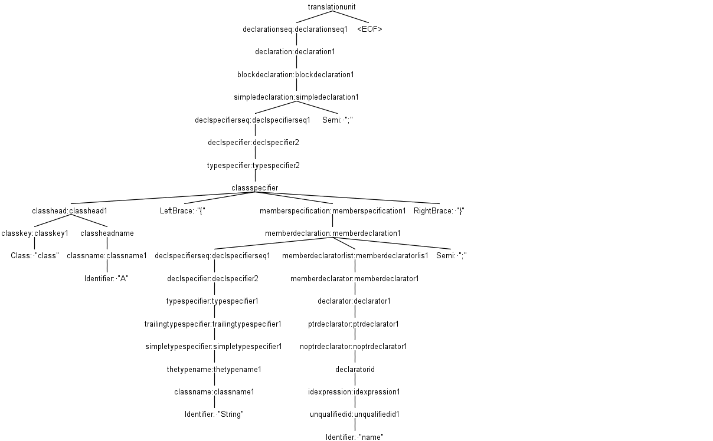
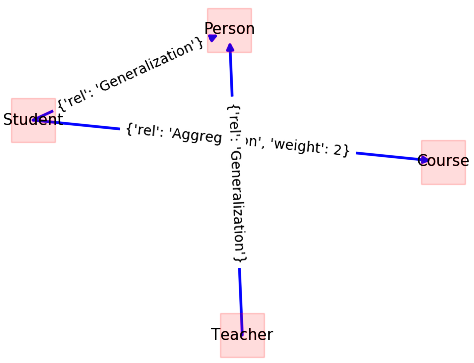

# Source code metrics computation

By: Morteza Zakeri
  
Last update: May 02, 2022

Edition 2


Source code metrics are extracted from the source code of the software, and their values allow us to reach conclusions about the quality attributes measured by the metrics.

A practical approach to computing such metrics is static program source code analysis. Again this analysis can be performed by using the compiler front-end to deal with the parse tree and symbol table. The idea is to create a symbol table for the program under analysis and extract desired metrics. In this section, we demonstrate the use of ANLTR to compute two essential design metrics, FANIN, and FANOUT, which affect the testability of a module. 

FANIN and FANOUT can be computed from UML class diagrams. In the case of source code, we require to extract the class diagram from the program source code. We begin with constructing a simple symbol table to hold the necessary entities, e.g., classes and their relationships. Similar to [our source code instrumentation tutorial](program_instrumentation.md), the ANTLR listener mechanism is utilized to build the symbol table. The structure of our symbol table is shown in Figure 1.


*Figure 1: Class diagram of a simple symbol table for C++*


The class diagram in Figure 1 has been implemented in Python. During syntax tree walking, each entity is recognized and saved in the corresponding instance of symbol table entities. For example, whenever a method is recognized, the instance of the Method class will be created to hold this method. The Model class is needed to keep a list of recognized classes as the top-level entities. The implementation code of the proposed symbol table in Python is straightforward, and we omit the code here.

The next step is creating a listener and adding codes to fill the symbol table. Listing 1 shows the listener used to recognize and add source code classes to the symbol table.

```Python

class DefinitionPassListener(CPP14Listener):
    """
    Pass 1: Extracting the classes and structs from a given CPP source code
    """

    def __init__(self, model: Model = None):
        if model is None:
            self.model = Model()
        else:
            self.model = model

        self.class_instance = None

    def enterClassspecifier(self, ctx: CPP14Parser.ClassspecifierContext):
        if self.class_instance is None:
            self.class_instance = Class()

    def exitClassspecifier(self, ctx: CPP14Parser.ClassspecifierContext):
        if self.class_instance is not None:     
			self.model.class_list.append(self.class_instance)
			self.class_instance = None

    def enterClassheadname(self, ctx: CPP14Parser.ClassheadnameContext):
        if self.class_instance is not None:
            self.class_instance.name = ctx.getText()
			

```

_Listing 1: Recognizing classes in source code  and inserting them into the symbol table_

When an instance of `DefinitionPassListner` in Listing 1 is passed to the `ParseTreeWalker` instance, the classes within the source code are identified and inserted into the symbol table. This task has been performed only by implementing the listener methods, which correspond to the class definition rule in C++ grammar. 

To better understand which methods of the base listener (`CPP14Listener`), generated by ANTLR, should be implemented to perform this task, we may look at the parse tree of the simple program, including one class with one field, as shown in Listing 2. 

```C
class A{
    string name;
};
```

_Listing 2: C++ code snip with one class and one field._

 The parse tree of code snip in Listing is shown in Figure 2.
The parse tree visualization can be performed by the [ANTLR plugin for IntelliJ IDEA](https://plugins.jetbrains.com/plugin/7358-antlr-v4-grammar-plugin).
One can see the complexity of the C++ language and its compilation. The pares tree for the program with only four lines of codes has 39 nodes and more than 350 parse decisions (invocation in the recursive descent parsing), which shows that the real programming languages are too complex. Therefore, the only way to analyze and test them is to utilize compiler techniques.




_Figure 2: The parse tree for the code snippet shown in Listing 2_


The recognized classes, by applying `DefinitionPassListner`, only have a name (set in Line 25). The `DefinitionPassListner` listener class does not capture any required relationships for computing FANIN and FANOUT or any other analysis. 

Relationships between classes in each program occurred in different ways, e.g., through the aggregation. In aggregation, one class has a field with the type of the other class. To extract the aggregation relationship, we should extract all fields whose types are user-defined. Therefore, we create another listener with the following codes:


```Python
class ResolvePassListener(DefinitionPassListener):
    """
    Pass 2: Extracting the classes' fields
    """
	 def __init__(self, model: Model = None):
        super(DefinitionPassListener, self).__init__(model=model)
		self.enter_member_specification = False
		self.field = Field()
		
	def enterMemberspecification(self, ctx: CPP14Parser.MemberspecificationContext):
		if ctx.getChildCount() == 3:
			self.enter_member_specification = True
			
	def enterDeclspecifier(self, ctx: CPP14Parser.DeclspecifierContext):
		if self.enter_member_specification:
			ctx_the_type_name = ctx.getText()    
			for class_instance in self.model.class_list:
				if ctx_the_type_name == class_instance.name:
					self.field.type = class_instance
					self.class_instance.fields.append(field)
					break

```

_Listing 3: Adding class fields to the program symbol table_


The method `enterDeclspecifier` is invoked by `ParseTreeWalker` each time a field is defined in the program source code. In `ResolvePassListener` an extra check is required to ensure that the recognized variable belongs to the class or not. The flag `enter_member_specification` is set to true in `enterMemeberspecification` method and used to understand the scope of the variable. In `enterDeclspecifier` method, the name of the variable is checked to find whether it is the name of another class or not. Indeed, if the field has a user-defined type, then the type of this field is resolved and added to the current class fields. 


There are some practical considerations at this point. Why has a separate class defined for resolving the fields of classes? The `ResolvePassListener` has inherited from `DefinitionPassListner`, but why? The reason for separating the listener code into two classes is that the symbol table can not be completed by traversing the parse tree only once. If we try to add the field of the class at the same time that we are adding the class itself, we may not be able to find the proper type of the user-defined fields since all types still have not been inserted into the symbol table. The best practice is that two separate analysis passes are applied. One for adding types to the symbol table called definition pass, and another one for resolving the types to check or complete their information called resolved pass. Each pass in the compiling process reads the source code from start to end.


The resolve pass inherits from the definition pass since the operation in the definition pass is still required. For example, Line 20 in  `ResolvePassListener` requires the current class when adding the recognized field to it. `DefinitionPassListner`, in Listing 1, is not suitable to use as a parent for ResolvePassListener. It only inserts new classes to the symbol table; however, we need to retrieve them when the ResolvePassListener is being applied. Another problem is that if the current code for `DefinitionPassListner` is executed more than once, the same class is inserted to self.model.class_list the object in the symbol table. We should fix the class `DefinitionPassListner` to solve these two problems.


First, before adding a new class (Line 25 in Listing 1), it should be checked that class has not existed in the symbol table. Second, if the class already exists in the code, in `enterClassheadname` method, the corresponding class should be retrieved by its name and assigned to `self.class_instance` object. These conditions are expected to be met when the `ResolvePassListener` is executed as a second pass of our analysis.
Listing 4 shows the modified version of the `DefinitionPassListner`.


```Python

class DefinitionPassListener(CPP14Listener):
    """
    Pass 1 (modified): Extracting the classes and structs
    """

    def __init__(self, model: Model = None):
        if model is None:
            self.model = Model()
        else:
            self.model = model

        self.class_instance = None

    def enterClassspecifier(self, ctx: CPP14Parser.ClassspecifierContext):
        if self.class_instance is None:
            self.class_instance = Class()

    def exitClassspecifier(self, ctx: CPP14Parser.ClassspecifierContext):
        if self.class_instance is not None:
			if self.model.find_calss_by_name(self.class_instance) == False: 
				self.model.class_list.append(self.class_instance)
			
				
			self.class_instance = None

    def enterClassheadname(self, ctx: CPP14Parser.ClassheadnameContext):
        if self.class_instance is not None:
			if self.model.find_calss_by_name(ctx.getText()):
				self.class_instance = self.medel.get_class_by_name(class_instance.name)
			else:
				self.class_instance.name = ctx.getText()

```

_Listing 4: The fixed version of the `DefinitionPassListener` class._


In this tutorial, we assumed that the input program is compilable, and hence we did not perform additional compile-time tasks such as type checking. The complete implementation of two listeners, including import statements and some additional codes, will be available on the [CodA repository](https://github.com/m-zakeri/CodA/). 

Once our listeners are completed, we can add a driver code to attach these listeners to a `ParseTreeWalker` and perform the target task, as discussed in the [ANTLR basic tutorial](antlr_basics.md). 
The only difference is that we have two listeners that must be executed in order to get the desired result. Listing 5 shows the driver code for our static analysis task.

 
```Python

stream = FileStream(input_string)
lexer = test_v2Lexer(stream)
token_stream = CommonTokenStream(lexer)
parser = test_v2Parser(token_stream)
parse_tree = parser.start()

pass1 = DefinitionPassListener()

walker = ParseTreeWalker()
walker.walk(listener=pass1, t=parse_tree)

pass2 = ResolvePassListener(model=pass1.model)
walker.walk.walk(listener=pass2, t=parse_tree)


```

_Listing 5: Driver coed to perform static analysis of the source code._


The last step in our analysis is to build the class diagram as a directed annotated graph forming the symbol table and compute the _FAN-IN_ and _FAN-OUT_ metrics for each class. This step is done by creating a node for each class and adding an edge between two classes, which have an aggregate relationship together. The direction of each edge specifies the direction of aggregation. 

Listing 6 shows the methods that create and visualize the discussed graph. Two methods are defined in the `Model` class, which was part of our symbol table in previous steps. The first method, `create_graph`, creates a graph for a class diagram. It uses the _NetworkX_ library to work with graphs. The second method, `draw_graph`, makes visualization of the created graph. The `Model` class also has two fields `class_list` and `class_diagram`, which have not been shown in Listing 6. 
The first field holds all class instances of the source code, and the second field holds the class diagram corresponding graph.


```Python
__date__ = '2021-07-19'
__author__ = 'Morteza Zakeri'

def create_graph(self):
	class_diagram = nx.DiGraph()
        for class_instance in self.class_list:
            class_diagram.add_node(class_instance.name)

        for class_instance in self.class_list:
            if class_instance.attributes_list is not None:
                for class_attribute in class_instance.attributes_list:
                    if isinstance(class_attribute.variable_type, Class) or 
						isinstance(class_attribute.variable_type, Structure):
                        w = 1
                        if class_diagram.has_edge(class_instance.name, class_attribute.variable_type.name):
                            w = class_diagram[class_instance.name][class_attribute.variable_type.name]['weight']
                            w += 1
                        class_diagram.add_edge(class_instance.name, class_attribute.variable_type.name,
                                               rel='Aggregation',
                                               weight=w)
        self.class_diagram = class_diagram

    def draw_graph(self):
        new_names_dict = dict()
        for node_name in self.class_diagram.nodes:
            new_names_dict.update({node_name: node_name})
        edge_labels = nx.get_edge_attributes(self.class_diagram, 'rel')
        edge_labels2 = nx.get_edge_attributes(self.class_diagram, 'cardinality')

        pos = nx.kamada_kawai_layout(self.class_diagram)
        nx.draw_networkx_nodes(self.class_diagram, pos,
                               nodelist=self.class_diagram.nodes,
                               node_shape='s',
                               node_size=1000,
                               alpha=0.25,
                               node_color='r')
        
		nx.draw_networkx_edges(self.class_diagram, pos,
                               edgelist=list(self.class_diagram.edges),
                               width=2.0,
                               alpha=0.95,
                               edge_color='b')
        nx.draw_networkx_edge_labels(self.class_diagram, pos, labels=edge_labels)
        nx.draw_networkx_edge_labels(self.class_diagram, pos, labels=edge_labels2)
        nx.draw_networkx_labels(self.class_diagram, pos, new_names_dict, font_size=11)

        plt.show()

```

_Listing 6: Methods for creating and visualizing a simple class diagram._


FAN-IN and FAN-OUT can for each class are defined respectively as in-degree and out-degree of the class diagram corresponding graph. Therefore, having that graph means that we can compute these metrics quickly. To illustrate the discussed static analysis on a real program, consider the C++ program in Listing 7, which has four simple classes: `Person`, `Student`, `Teacher`, and `Course`. The implementation of classes has been omitted for simplicity. Both the `Student` class and `Teacher` class have been inherited from the class `Person`. In addition, the `Student`  class has aggregated an instance of the `Course` class. 


```Cpp

# include <string>
# include <iostream>
using namespace std;

class Person
{
protected:
	 string firstName;
	 string lastName;
	 int nationalCode;
public:
	Person(string firstName, string lastName, int nationalCode);
	void setPersonName(string firstName, string lastName);
	virtual int doJob();
};

Person::Person(string firstName, string lastName, int nationalCode)
{
	this->firstName = firstName;
	this->lastName = lastName;
	this->nationalCode = nationalCode;
}

void Person::setPersonName(string firstName, string lastName)
{
	this->firstName = firstName;
	this->lastName = lastName;
}

int Person::doJob()
{
	cout << this->firstName << " is a person " << endl;
	return 0;
}

class Student: public Person
{
private:
	long studentNumber;
	Course* cource;
public:
	Student(string firstName, string lastName, int nationalCode, long studentNumber);
	int doJob() override;
};

Student::Student(string firstName, string lastName, int nationalCode, long studentNumber):Person(firstName, lastName, nationalCode)
{
	this->studentNumber = studentNumber;
	cout << "I am a student: " << this->studentNumber << endl;
	this->cource = new Course();
	this->cource->name = "Software Engieering";
}

int Student::doJob()
{
	cout << this->firstName << " is studing " << endl;
	return 20;
}

class Teacher: public Person
{
private:
	long teacherNumber;
public:
	Teacher(string firstName, string lastName, int nationalCode, long teacherNumber);
	int doJob() override;
};

Teacher::Teacher(string firstName, string lastName, int nationalCode, long teacherNumber):Person(firstName, lastName, nationalCode)
{
	this->teacherNumber = teacherNumber;
	cout << "I am a teacher: " << this->teacherNumber << endl;
}

int Teacher::doJob()
{
	cout << this->firstName << " is teaching " << endl;
	return 0;
}

class Course
{
public:
	string name;
	int number;
	Course(string course_name, int course_numbber = 0);
};

Course::Course(string course_name, int course_numbber)
{
	this->name = course_name;
	this->number = course_numbber;
}

/* main function */
int main()
{
    Teacher t1("Saeed", "Parsa", 1234, 1398);
    Student s1("Morteza", "Zakeri", 5678, 2020);
    t1.doJob();
    s1.doJob();
}
```

_Listing 7: A C++ application to test the developed static analysis program in this tutorial._


The corresponding graph for the class diagram of this program, which is the output of executing codes in Listings 5 and 6, has been shown in Figure 3. As one can see, the inheritance relationships also have been shown in the figure. We omitted the code that captures the inheritance relationship in this section. You may ask to implement the extraction of inheritance relationships after reading this tutorial. 




_Figure 3: Class diagram for the program shown in Listing 7._

FAN-IN and FAN-OUT metrics can be computed, as discussed earlier. For this simple example, FAN-IN for class Student is 0, and FAN-OUT is one; however, for complete computation of these metrics, all relationships, including association, dependencies, and parameters passing, should be considered. 


## Summary
In this tutorial and the [previous one](program_instrumentation.md), I discussed the application of compilers in static and dynamic software analysis. I demonstrated these applications through a simple example of source code instrumentation and metrics computation. The former is a transformation task that modifies the source code, and the latter is an analysis task that extracts some information from the source code. Both of them are essential tasks in the future of software engineering. 

Systematic software testing and quality assurance tools can be built on top of compiler tools such as ANTLR, LLVM, JDT, and Roslyn, with techniques presented in this chapter. Compilers build a detailed model of application code as they validate the syntax and semantics of that code. While traditional compilers used such a model to build the executable output from the source code in a block box manner, the new generation of compilers provides APIs to access the internal details of this model, which can be utilized to build more reliable software. Software testing is more realistic with advanced support by compilers.
